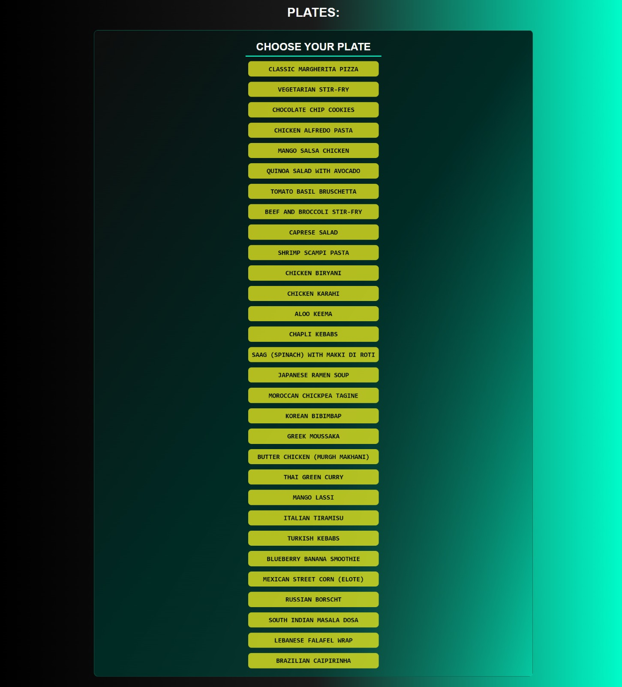
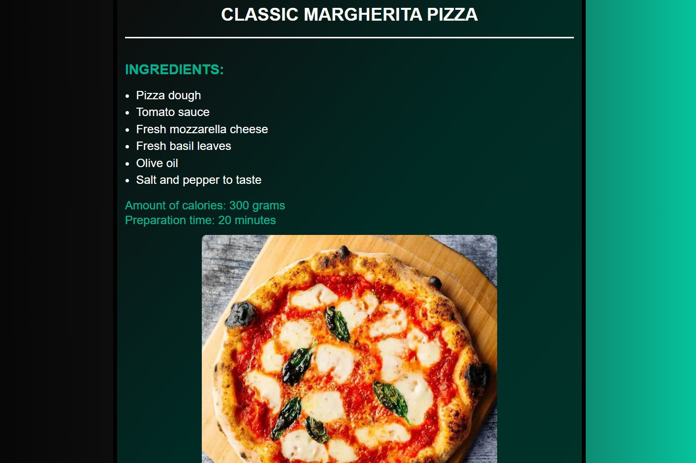
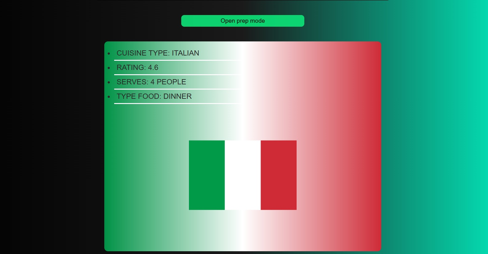
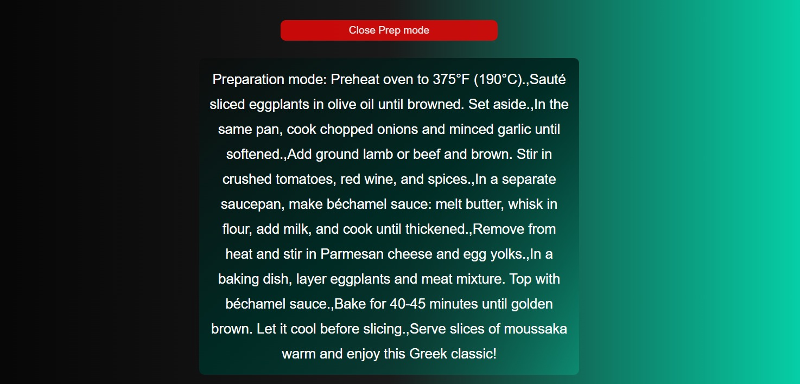

🍽️ **Recipe Viewer**

Projeto front-end que consome receitas de uma API e exibe informações detalhadas sobre cada prato, incluindo ingredientes, calorias, tempo de preparo, instruções, tipo de culinária e classificação.
OBS: Projeto em inglês

---

🖼️ **Preview do Projeto**

<p align="center">
  
  
</p>

<p align="center">
  
  
</p>

---

🚀 **Funcionalidades**

* Listagem de receitas com botão para cada prato
* Exibição de ingredientes, calorias, tempo de preparo e imagem do prato
* Instruções de preparo com botão de abrir/fechar
* Informações extras: tipo de culinária, rating, porções e tipo de refeição
* Destaque visual para o prato selecionado
* Layout simples e responsivo

---

📂 **Como usar**

Deploy do projeto:

```bash
https://pratos-receitas-api.vercel.app/
```

---


