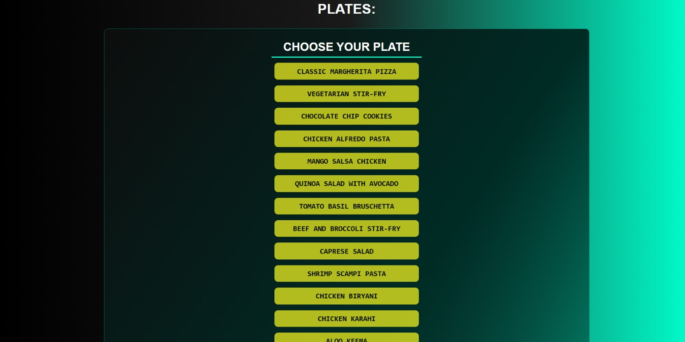

# 🍽️ Recipe Viewer


Projeto front-end que consome receitas de uma API e exibe informações detalhadas sobre cada prato, incluindo ingredientes, calorias, tempo de preparo, instruções, tipo de culinária e classificação.

> ⚠️ Projeto desenvolvido em inglês.

---

## 🌍 Sobre o projeto

Esta aplicação consome dados de uma API de receitas e apresenta as informações de forma organizada e visual, permitindo ao usuário explorar diferentes pratos com detalhes completos de preparo e nutrição.

---

## 🖼️ Preview

<div align="center">
  
  
</div>

<div align="center">
  
  
</div>

---

## 🚀 Funcionalidades

✔️ Listagem de receitas com botão para cada prato  
✔️ Exibição de ingredientes, calorias, tempo de preparo e imagem do prato  
✔️ Instruções de preparo com botão de abrir/fechar  
✔️ Informações extras: tipo de culinária, rating, porções e tipo de refeição  
✔️ Destaque visual para o prato selecionado  
✔️ Layout simples e responsivo  

---

## 🛠️ Tecnologias utilizadas

- HTML5
- CSS3
- JavaScript (Vanilla JS)

---

## 🎯 Objetivo do projeto

- Praticar consumo de APIs externas
- Manipular e exibir dados dinâmicos no DOM
- Trabalhar com interatividade e estados da interface
- Desenvolver um layout responsivo e funcional

---

## 🌐 Deploy

Acesse o projeto online:  
👉 https://pratos-receitas-api.vercel.app/

## ▶️ Como rodar o projeto

```bash
# Clone o repositório
git clone https://github.com/gabrieldev25789/recipe-viewer.git

# Acesse a pasta
cd recipe-viewer

# Abra no navegador
index.html
```


